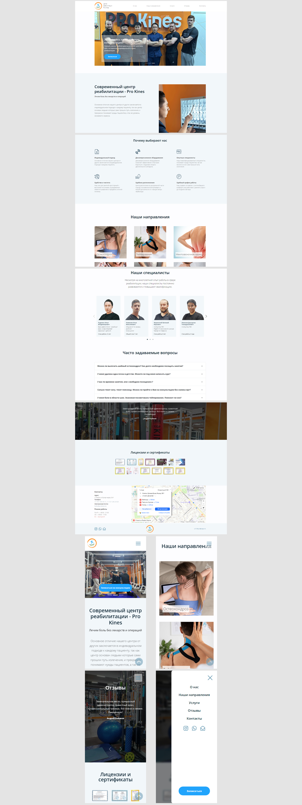

# Лендинг центра реабилитации

Проект выполнен для центра реабилитации в городе Алматы **[(ссылка на лендинг)](https://prokines.kz/)**

## Внешний вид

## Выполненные задачи:
- Составление технического задания;
- Разработка внешнего вида сайта;
- Создание лендинга в соответствии с пожеланиями клиента;
- Реализация адаптивной верстки сайта;
- Реализация возможности оставления заявки на сайте и её отправки на почту клиента;
- Размещение сайта на хостинг-сервисе.

## Используемые технологии:
* HTML
* CSS (SCSS)
* JavaScript
* Gulp
* Доп. библиотеки (jQuery, Slick, Magnific Popup, Bootstrap)